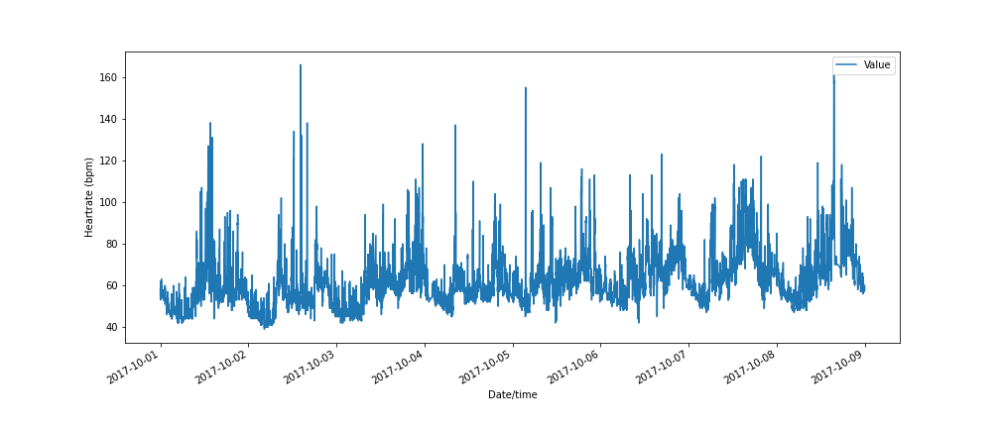

# Python for Data Analysis: Presentation Assignment



Term: Spring 2022

+ **Team**: Group 4
+ **Project title**: Anomaly detection using statistical learning for identifying possible heart attacks
+ **Team members**:
  + [Jiachen Hu](jh4494@columbia.edu) (jh4494@columbia.edu)
  + [Jiayi Wang](jw4028@columbia.edu) (jw4028@columbia.edu)
  + [Marcus Loke](https://www.linkedin.com/in/lokemarcus/) (ml4636@columbia.edu)
  + [Qinyun Luo](ql2400@columbia.edu) (ql2400@columbia.edu)
  + [Rohit Kundurthi](rk3141@columbia.edu) (rk3141@columbia.edu)
  + [Xin Li](xl3171@columbia.edu) (xl3171@columbia.edu)
  + [Yafei Wen](yw3764@columbia.edu) (yw3764@columbia.edu)
  + [Yinjie Dai](yd2597@columbia.edu) (yd2597@columbia.edu)
  + [Yunzi Ma](ym2826@columbia.edu) (ym2826@columbia.edu)
  + [Zheyu Xu](zx2347@columbia.edu) (zx2347@columbia.edu)

+ **Project summary**: This project seeks to use the anomaly detection (seasonal ESD) functions from the [GitHub repo](https://github.com/nachonavarro/seasonal-esd-anomaly-detection) by Nacho Navarro, which is the Python code of the technique that [Jordan Hochenbaum, Owen S. Vallis and Arun Kejariwa](https://arxiv.org/pdf/1704.07706.pdf) at Twitter Inc. have created. We attempt to use the seasonal ESD function to flag out anomalies in the human heartrate, leading to better detection and timely prevention of a heart attack.

+ **Technologies used**: Python

Following [suggestions](http://nicercode.github.io/blog/2013-04-05-projects/) by [RICH FITZJOHN](http://nicercode.github.io/about/#Team) (@richfitz). This folder is orgarnized as follows.

```
proj/
├── lib/
├── data/
├── doc/
├── figs/
└── output/
```

Please see each subfolder for a README file.
